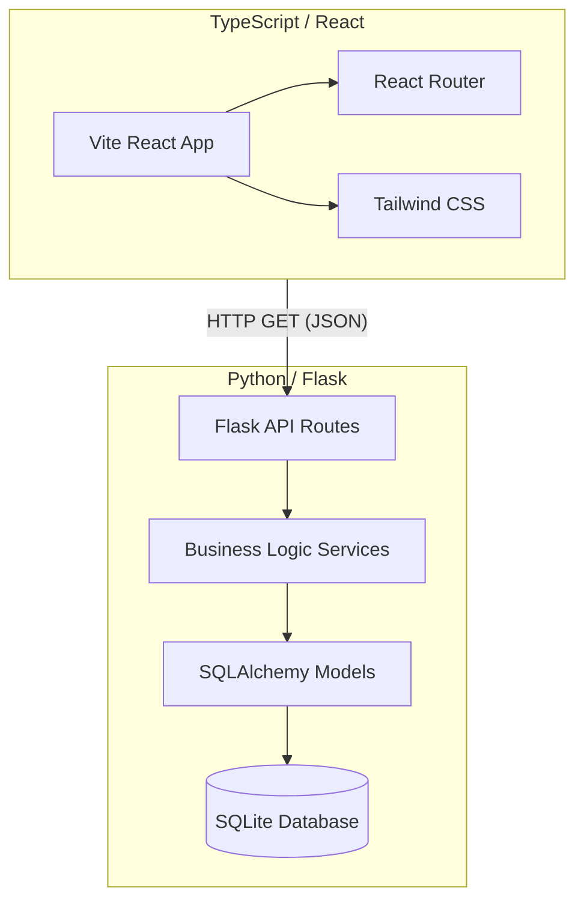

#  TUparkingLocation

เว็บแอปพลิเคชันสมัยใหม่ที่ตอบสนองรวดเร็ว (Responsive) สำหรับค้นหาที่จอดรถว่างภายในมหาวิทยาลัยธรรมศาสตร์

ระบบนี้ถูกพัฒนาโดยใช้สถาปัตยกรรมแบบ **Decoupled Architecture (แยกส่วน Frontend/Backend)** โดยมี Backend เป็น Python (Flask) แบบ RESTful API และ Frontend เป็น TypeScript (React + Vite)

---

## System Architecture

โปรเจกต์นี้แยกส่วนระหว่าง UI (Frontend) และ Logic/Data (Backend) อย่างชัดเจน



### 📁 Project Structure

```text
TUparkingLocation/
├── app/                  # Backend (Python Flask)
│   ├── routes/           # Controller: จัดการ API request
│   ├── services/         # Business Logic: query DB และจัดรูปแบบข้อมูล
│   ├── models/           # Data Models: โครงสร้างข้อมูล (SQLAlchemy)
│   └── __init__.py       # Factory: ตั้งค่า Flask และ seed ข้อมูล
├── frontend/             # Frontend (TypeScript React + Vite)
│   ├── src/pages/        # หน้า React (List และ Detail)
│   └── src/index.css     # Tailwind สำหรับ styling ทั้งระบบ
├── tu_parking.db         # ไฟล์ฐานข้อมูล SQLite
├── requirements.txt      # dependencies ของ Python
└── run.py                # จุดเริ่มต้นรัน backend
```

---

## 🚀 Getting Started

เนื่องจากเป็นสถาปัตยกรรมแบบแยกส่วน (Decoupled) จำเป็นต้องรันทั้ง Backend และ Frontend พร้อมกัน

### Option A: ใช้ Docker (แนะนำ ✅)

รันทุกอย่างด้วยคำสั่งเดียว:

```bash
docker compose up --build
```

| Service | URL |
|---------|-----|
| Frontend (React) | http://localhost:5173 |
| Backend API (Flask) | http://localhost:5000/api/parking |

### Option B: รันแบบ Manual (Local)

เปิด **2 terminals** พร้อมกัน:

**Terminal 1 — Python Backend:**
```bash
pip install -r requirements.txt
python run.py
```

**Terminal 2 — React Frontend:**
```bash
cd frontend
npm install
npm run dev
```

เปิด `http://localhost:5173` ในเบราว์เซอร์เพื่อใช้งานระบบ

---

## 🛠️ How to Extend

- **เพิ่ม Machine Learning**: แก้ไขไฟล์ `app/services/parking_service.py` เพื่อดักจับการ query ฐานข้อมูลและใช้โมเดลการทำนาย
- **Real-Time Data**: Integrate `Flask-SocketIO` เพื่อสตรีมการเปลี่ยนแปลงสถานะช่องจอดไปยัง React frontend แบบเรียลไทม์
- **Production Deployment** (เมื่อพัฒนาเสร็จ):
  1. ดู `docker-compose.prod.yml` ที่เตรียมไว้ (มี TODO comment อธิบายทุกขั้นตอน)
  2. สร้าง `frontend/Dockerfile.prod` (Multi-stage build → Nginx)
  3. เปลี่ยน SQLite → PostgreSQL ใน `docker-compose.prod.yml`
  4. รัน: `docker compose -f docker-compose.prod.yml up --build`